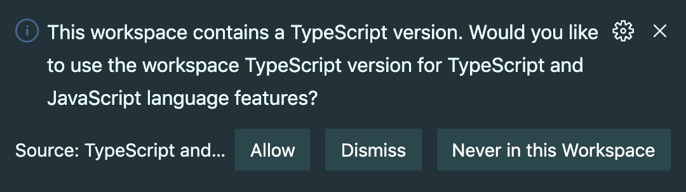

# Node.js SAM Template

## Getting Started

<!-- ### AWS SAM CLI

This project requires the `sam` command line tool.

To install the AWS SAM CLI, see the following instructions for your development host:

- [Installing the AWS SAM CLI on Linux](https://docs.aws.amazon.com/serverless-application-model/latest/developerguide/serverless-sam-cli-install-linux.html)
- [Installing the AWS SAM CLI on Windows](https://docs.aws.amazon.com/serverless-application-model/latest/developerguide/serverless-sam-cli-install-windows.html)
- [Installing the AWS SAM CLI on macOS](https://docs.aws.amazon.com/serverless-application-model/latest/developerguide/serverless-sam-cli-install-mac.html)

> Contrary to what the linked documentation may suggest, an AWS account with administrator permissions is not required to install `aws-sam-cli` -->

### Yarn 2

This project uses Yarn 2, and the Yarn binary is managed locally by (and committed directly to) this project repo. However, it is still necessary to have _a version_ of yarn installed globally to provide `yarn` on the shell path.

```sh
npm install -g yarn
```

Run `yarn --version` in this project workspace to confirm that version `2.x.x` is resolved.

**Some common CLI commands have changed as of Yarn 2**

| Yarn Classic (1.x)      | Yarn (2.x)                 |
| ----------------------- | -------------------------- |
| `rm -rf node_modules`   | `yarn cache clean --all`   |
| `yarn global add [pkg]` | `yarn dlx [pkg]`           |
| `yarn outdated`         | `yarn upgrade-interactive` |

> See Yarn 2 [Migration](https://yarnpkg.com/getting-started/migration) for more information.

### Editor Setup

Special configuration is required if you are using an IDE (such as VSCode) to allow the editor to correctly resolve installed workspace modules.

**VSCode**

VSCode will display a prompt to switch to the "workspace TypeScript version" when opening a `.js` or `.ts` fille in this project.



Click "Allow" to configure the editor to use the locally installed TypeScript server.


A `-pnpify` tagged TypeScript version is displayed at the right of the editor status bar when correctly configured.

**Other Editors**

Visit the Yarn 2 [Editor SDKs](https://yarnpkg.com/getting-started/editor-sdk) documentation for details on configuring integration with other editors.

Untested documentation on configuring Intellij can be [found here](https://www.jetbrains.com/help/idea/installing-and-removing-external-software-using-node-package-manager.html).
